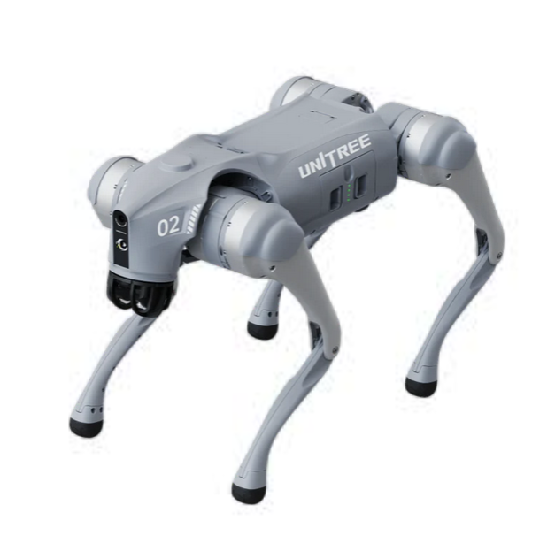
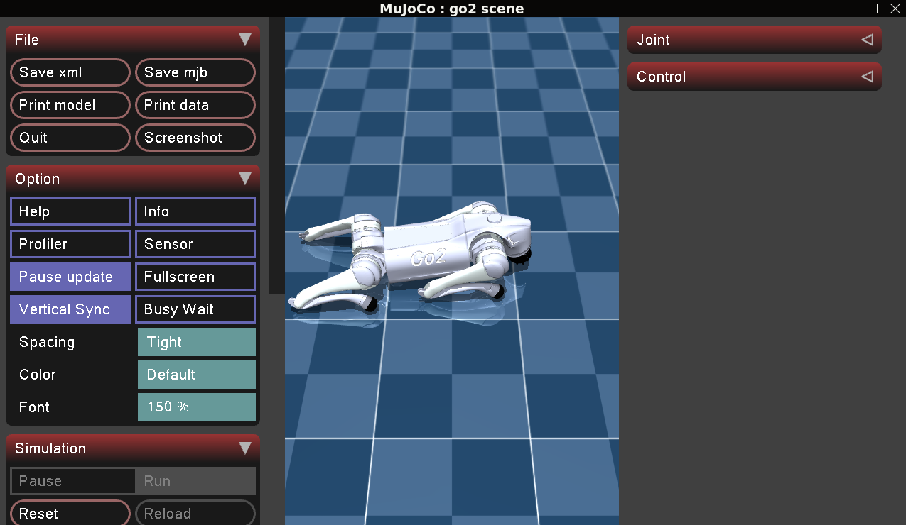
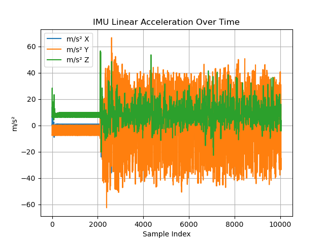
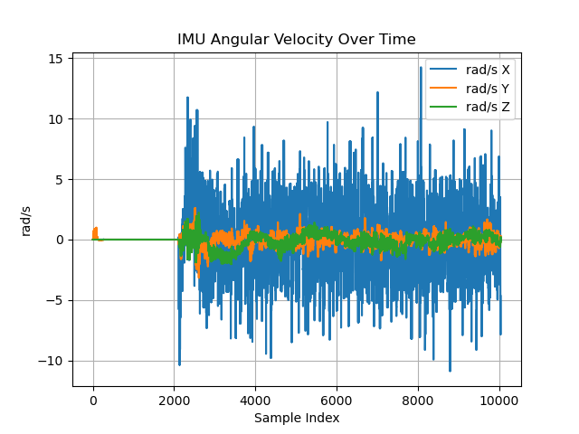

# Go2_ROS2 Toolkit 
### Unofficial SDK for Quadruped Control (Unitree GO2)

This repository provides an **unofficial SDK** for conducting experiments on control and navigation with the **Unitree GO2** quadruped robot.



---
## Launch instructions:

To clone the repository **with submodules**, run the following:

```bash
git clone --recurse-submodules https://github.com/illusoryTwin/go2_ros2_control_sim 

git submodule update --init --recursive
```

In the project root directory (`go2_ros2_control_sim`)

```bash
make run
```

Or, you can choose a desired type of controller by passing it as an argument `CTRL` like:

```bash
make run CTRL=unitree_guide
``` 

or 

```bash
make run CTRL=rl
``` 

After launching, new terminal windows should open for logging, keyboard input control, Mujoco simulation.
A Mujoco simulation window should open for visualizing the robot.



## Requirements

libtorch 


## Repository Structure

This repository contains ROS 2 packages and scripts for controlling and simulating the Unitree Go2 robot.

### `controller/`
Contains two types of controllers:
- **RL Controller**: Based on reinforcement learning.
- **Classic Controller**: Based on Unitree's guide controller.

### `commands/`
Provides an interface for sending commands to the robot via:
- Keyboard
- Joystick
- Predefined movement tasks

### `description/`
Includes configuration files and descriptions of robot control modes.

### `bringup/`
Launch utilities for starting the robot control system.

---

## Scripts

### `utils/`

provide a tool for processing the robot state data 

### `scripts/`
Contain bash scripts for sourcing the necessary environment variables and dependencies and launch of the main ROS nodes and associated launch files to control the robot.  

---

When simulation is launched the data from topics is saved as a rosbag. To further analyze this dadta, one can  launch 

```bash
cd utils
python3 plot_data.py
```

Example of output plot should be as follows:





## Notes

- This is not an official Unitree SDK.
